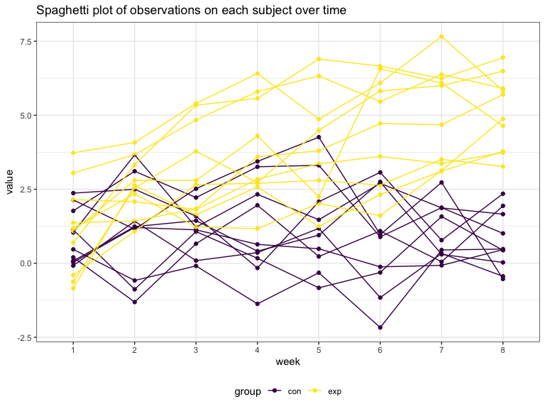
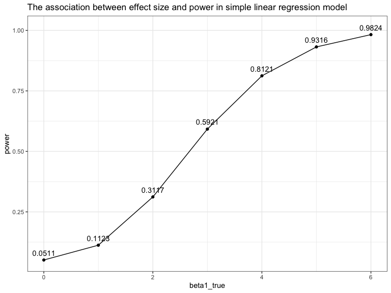

p8105\_hw5\_gl2677
================
Gaotong LIU
11/3/2019

## Problem 1

``` r
set.seed(10)

iris_with_missing = iris %>% 
  map_df(~replace(.x, sample(1:150, 20), NA)) %>%
  mutate(Species = as.character(Species)) 

missing_fill = function(x) {
  if (is.numeric(x)) {
    mean = mean(x, na.rm = TRUE)
    x = replace_na(x, mean) %>% round(digits = 2)
  } else if (is.character(x)) {
    x = replace_na(x, "virginica")
  }
  return(x)
}

map(iris_with_missing, missing_fill) %>% 
  bind_rows() %>% 
  head() %>% 
  knitr::kable()
```

| Sepal.Length | Sepal.Width | Petal.Length | Petal.Width | Species |
| -----------: | ----------: | -----------: | ----------: | :------ |
|          5.1 |         3.5 |          1.4 |        0.20 | setosa  |
|          4.9 |         3.0 |          1.4 |        0.20 | setosa  |
|          4.7 |         3.2 |          1.3 |        0.20 | setosa  |
|          4.6 |         3.1 |          1.5 |        1.19 | setosa  |
|          5.0 |         3.6 |          1.4 |        0.20 | setosa  |
|          5.4 |         3.9 |          1.7 |        0.40 | setosa  |

## Problem 2

``` r
df =
  tibble(file_names = list.files("data/"),
         path = str_c("data/", list.files("data/"))) %>%
  mutate(observation = map(path, read_csv)) %>% 
  mutate(file_names = str_replace(file_names, ".csv", "")) %>% 
  separate(file_names, into = c("group", "id"), remove = FALSE) %>% 
  select(-path) %>% 
  unnest() %>% 
  pivot_longer(week_1:week_8,
               names_prefix = "week_",
               names_to = "week",
               values_to = "value")

df %>% 
  ggplot(aes(x = week, y = value, color = group)) + 
  geom_point() + 
  geom_line(aes(group = file_names)) +
  labs(title = "Spaghetti plot of observations on each subject over time")
```



  - The value in the control group fluctuates between 4.26 and -2.17
    over eight weeks.

  - The value in the experiment group gradually increases over eight
    weeks. The mean value increases from 1.141in week 1 to 5.119 in week
    8.

## Problem 3

``` r
## simple linear function
sim_regression = function(n =30, beta0 = 2, beta1) {
  sim_data = tibble(
    x = rnorm(n, mean = 0, sd = 1),
    y = beta0 + beta1 * x + rnorm(n, 0, sqrt(50))
)
  ls_fit = lm(y ~ x, data = sim_data)
  broom::tidy(ls_fit)
}

## beta1  = 0
sim_results =
  rerun(10000, sim_regression(beta1 = 0)) %>%
  bind_rows() %>%
  filter(term == "x") %>%
  select(estimate, p.value) %>%
  mutate(significant = as.numeric(p.value < 0.05))

##  rerun simple linear fucntion
simulate_n_regressions = function(n_runs = 10000, n =30, beta0 = 2, beta1) { rerun(n_runs, sim_regression(n, beta0, beta1)) %>%
    bind_rows()
}
## beta1  = {0,1,2,3,4,5,6}
sim_results =
  tibble(beta1_true = 0:6) %>%
  mutate(
    estimate_dfs = map(.x = beta1_true, ~simulate_n_regressions(beta1 = .x))
) %>%
  unnest() %>%
  filter(term == "x") %>%
  select(beta1_true, estimate, p.value) %>%
  mutate(significant = as.numeric(p.value < 0.05))
```

### Power and effect size

``` r
sim_results %>% 
  group_by(beta1_true) %>% 
  summarise(power = sum(significant)/10000) %>% 
  ggplot(aes(x = beta1_true, y = power)) + 
  geom_point() +
  geom_line() +
  geom_text(aes(y = power + 0.03, label = power)) +
  labs(title = "The association between effect size and power in simple linear regression model")
```



The power is the proportion of times the null was rejected and the
effect size is the difference of the true value of beta 1 and 0. The
power increases as the effect size of true beta1 increases. When true
beta1 = 0, it is equal to the null hypothesis. So the power in this case
is the probability to reject null under the null hypothesis, which is
near alpha = 0.05.

### Estimate and True of beta1

``` r
sim_results %>% 
  group_by(beta1_true) %>% 
  nest() %>% 
  mutate(
    all = map_dbl(.x = data, ~ .x %>% pull(estimate) %>% mean),
    significant = map_dbl(.x = data, ~ .x %>% filter(significant == 1) %>%
                       pull(estimate) %>% mean)) %>% 
  select(-data) %>% 
  pivot_longer(all:significant,
               names_to = "type",
               values_to = "beta1_estimate") %>% 
  ggplot(aes(x = beta1_true, y = beta1_estimate, color = type)) +
  geom_point() + 
  geom_line() +
  labs(title = "The average estimate of beta1 aginst true beta1",
       subtitle = "in all samples and in the samples for which the null was rejected")
```


The sample average of estimate of beta1 across tests for which the null
is rejected is not approximately equal to the true value of beta1. The
overall sample average of estimate of beta1 is equal to the true value
of beta1.

This is because for small effect sizes, only thoes estimates that are by
chance far away from true beta1 can be rejected, in other words, there
is small probability to detect the true value of beta1. The significant
results are distorted by the extreme results. For large effect sizes, as
the true value is already big enough to be detected，so there is large
probability to detect the true value of beta1. The significant(rejected)
average is similar to overall average.
